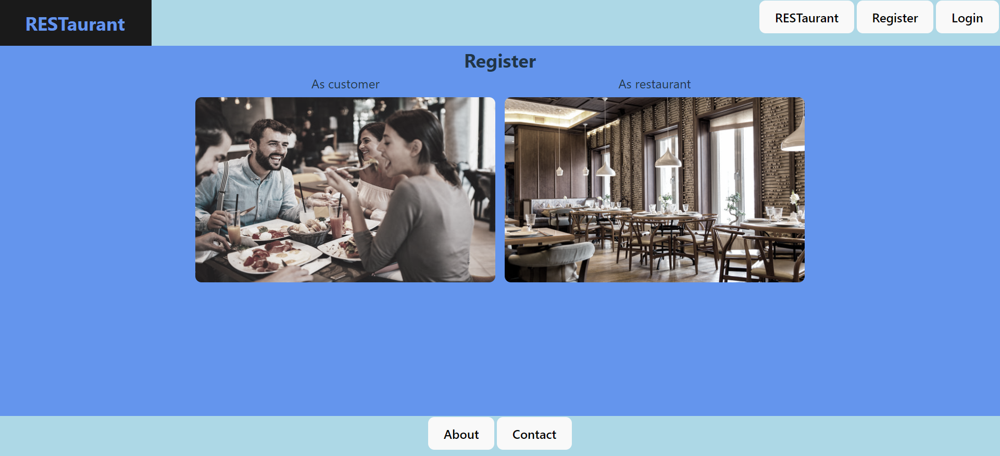
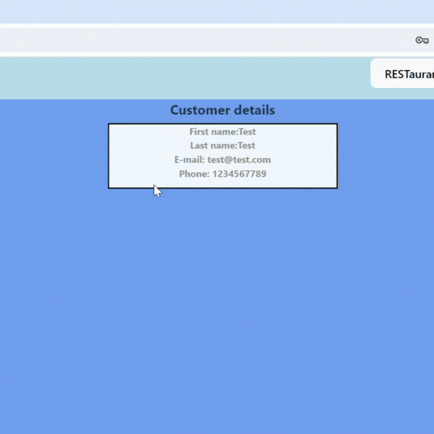
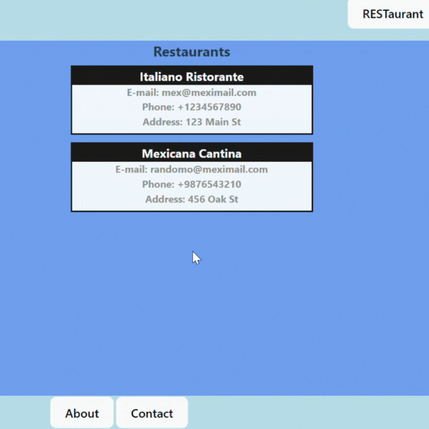
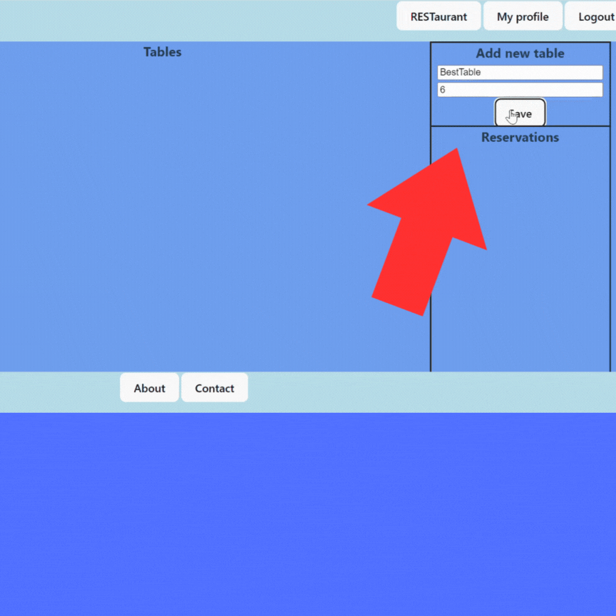
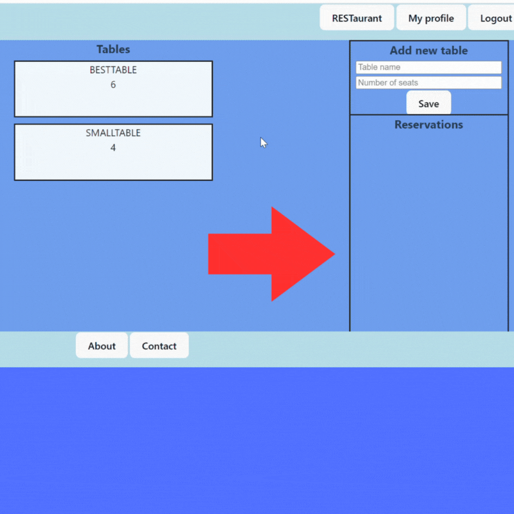

<!-- PROJECT LOGO -->
 

  

<h3 align="center">RESTaurant API - Table Reservation App</h3>

  

  RESTAurant API is an online table reservation system designed to meet the needs of restaurants and customers, because the project allows both restaurants and customers to register.
     
    <a href="https://github.com/CodecoolGlobal/el-proyecte-grande-sprint-1-java-attila-kerekes/tree/development/frontend"><strong>Frontend with React »</strong></a>
       
     <a href="https://github.com/CodecoolGlobal/el-proyecte-grande-sprint-1-java-attila-kerekes/tree/development/backend"><strong>Backend wih Java Spring Boot »</strong></a>
     
  

<!-- TABLE OF CONTENTS -->

  
Table of Contents

  <ol>
    <li>
      <a href="#about-the-project">About The Project</a>
      <ul>
        <li><a href="#built-with">Built With</a></li>
      </ul>
    </li>
    <li>
      <a href="#getting-started">Getting Started</a>
      <ul>
        <li><a href="#prerequisites">Prerequisites</a></li>
      </ul>
    </li>
    <li><a href="#contact">Contact</a></li>
    <li><a href="#license">License</a></li>

  </ol>

<!-- ABOUT THE PROJECT -->
## About The Project

RESTAurant API is a comprehensive online table reservation system designed to serve both restaurants and customers. By allowing both parties to register, the platform ensures easy registration and efficient management for restaurants while offering customers a smooth booking experience.
  <h3>Features For Restaurants</h3>
  <ul>
   <li><strong>Registration and Profile Management:</strong></li>
      Restaurants can register, create, and update their profiles, including details like location, cuisine type, and operating hours.
     
     
    <li><strong>Table Management:</strong></li>
      Manage tables, set availability, and configure table layouts to maximize seating arrangements.
     
     
    <li><strong>Reservation Management:</strong></li> 
      Reservations in real-time, and manage upcoming bookings through an intuitive dashboard.
  </ul>
  <h3>Features For Customers</h3>
   <ul>
    <li><strong>User Registration and Profile Management:</strong></li>
    Customers can sign up, create, and update their profiles.
     
     
    <li><strong>Search and Discover:</strong></li>
    Search for restaurants by location, cuisine, and availability. View restaurant profiles.
     
     
    <li><strong>Reservation Booking:</strong></li>
    Book tables in real-time with instant or cancel reservations if needed.
     
     
    </ul>
  <h3>Technical Implementation</h3>
  Throughout the project, our primary professional focus was on adhering to SOLID principles. We utilized Spring Data and JPA for effective data management and integrated PostgreSQL to ensure a robust database solution. Additionally, we implemented Spring Security and JWT to enhance application security. This project not only refined our backend development skills but also emphasized the importance of teamwork in building complex software solutions from scratch.

(<a href="#readme-top">back to top</a>)

### Built With

* [![React][React.js]][React-url]
* [![Spring Boot][Springboot.js]][Springboot-url]
* [![PostgreSQL][Postgresql.js]][Postgresql-url]

(<a href="#readme-top">back to top</a>)

<!-- GETTING STARTED -->
## Getting Started

### Prerequisites

### General 
- Node.js
- npm
- JDK 11+
- Maven

### Frontend (React)

 1.   **Clone the repository and navigate to the frontend directory:**
  - git clone your-repo-url && cd your-frontend-directory

 2.  **Install dependencies and start the development server:**
  - npm install && npm run dev

### Backend (Spring Boot)

 1.   **Navigate to the backend directory:**
  -  cd your-backend-directory

 2.   **Build and run the application:**
  - mvn clean install && mvn spring-boot:run

 ### Next feature

Before running the Docker image, ensure you have the following:

1. **Docker Desktop** installed and running.

2. **Basic Terminal/Command Prompt** knowledge.
   - You should be comfortable using terminal or command prompt commands.

3. **Sufficient Disk Space and Permissions**.
   - Ensure you have adequate disk space and the necessary permissions to install and run Docker images and containers.

Once you have Docker Desktop installed and running, you can proceed with pulling and running the Docker image.
 

(<a href="#readme-top">back to top</a>)

<!-- USAGE EXAMPLES -->
## Usage

**Customer**

1. <strong>Sign up for a customer account.</strong>
   
     
     
    
 
 

2. <strong>Browse available restaurants.</strong>
    
     
    

3. <strong>Select a restaurant, choose the number of seats required and a date and time for your reservation.</strong>
     
     
    
      
     
         
     
**Restaurant**

1. <strong>Sign up for a restaurant account.</strong>
   
     
     
    
 
 

2. <strong>Add available tables with detail such as capacity.</strong>
   
     
     
    
 
 

3. <strong>View incoming reservations.</strong>
   
     
     
    
 
 

(<a href="#readme-top">back to top</a>)

<!-- CONTACT -->
## Contact

Attila Kerekes - attila.g.kerekes@gmail.com
   
Ember Zsolt - zsolt.ember95@gmail.com
   
Miskei Máté - miskei.mate@gmail.com
   
Simon Kamilla - smnkamilla@gmail.com

Project Link: [https://github.com/CodecoolGlobal/el-proyecte-grande-sprint-1-java-attila-kerekes](https://github.com/CodecoolGlobal/el-proyecte-grande-sprint-1-java-attila-kerekes)

(<a href="#readme-top">back to top</a>)

## License

Distributed under the MIT License. 

(<a href="#readme-top">back to top</a>)

<!-- MARKDOWN LINKS & IMAGES -->

[React.js]: https://img.shields.io/badge/React-20232A?style=for-the-badge&logo=react&logoColor=61DAFB
[React-url]: https://reactjs.org/
[Springboot.js]: https://img.shields.io/badge/Spring%20Boot-lightgreen?style=for-the-badge&logo=springboot
[Springboot-url]: https://docs.spring.io/spring-boot/
[Postgresql.js]: https://img.shields.io/badge/PostgreSQL-lightblue?style=for-the-badge&logo=postgresql
[Postgresql-url]: https://www.postgresql.org/
